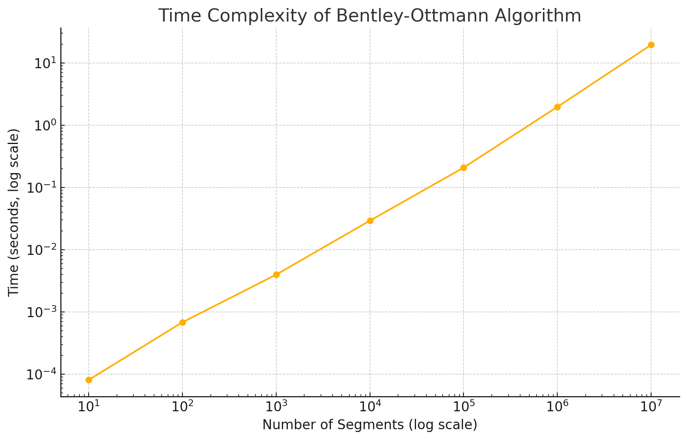

# BentleyOttmannSweepLine

This repository contains an implementation of the Bentley-Ottmann sweep line algorithm, used for detecting intersections in a set of line segments.

## Description

### Short Description
The Bentley-OttmannSweepLine repository implements the Bentley-Ottmann sweep line algorithm for detecting intersections among a collection of line segments. This algorithm is efficient and widely used in computational geometry for solving intersection problems.

### Long Description
The Bentley-Ottmann algorithm is a fundamental algorithm in computational geometry, particularly for finding all intersections in a set of line segments. This repository provides a C++ implementation of the algorithm, along with example runs and performance evaluations. The implementation includes essential components such as event handling, segment comparison, and the sweep line mechanism.

## Repository Structure

```
BentleyOttmannSweepLine/
│
├── include/
│   ├── Point.h
│   ├── Segment.h
│   ├── Event.h
│   ├── CompareSegment.h
│   └── SweepLineAlgorithm.h
│
├── src/
│   ├── main.cpp
│   ├── Event.cpp
│   └── SweepLineAlgorithm.cpp
│
├── data
│   ├── output.png
│   ├── output(1).png
│   ├── output(2).png
│   ├── output3).png
├── CMakeLists.txt
├── README.md
```

## How to Execute and Run the Code

### Prerequisites
- C++ compiler (e.g., g++)
- CMake

### Build Instructions
1. Navigate to the root directory of the repository.
2. Create a build directory:
    ```bash
    mkdir build
    cd build
    ```
3. Generate the build files using CMake:
    ```bash
    cmake ..
    ```
4. Compile the project:
    ```bash
    make
    ```

### Running the Code
After building the project, you can run the executable:
```bash
./BentleyOttmannSweepLine
```

## How to Rerun the Code After Making Changes

1. Make the necessary changes to the source files.
2. Rebuild the project by repeating the steps in the **Build Instructions** section.
3. Do not forget to remove **build** folder in order to recompile the project. Additionally, you can hit **make clean** without removing the build folder.

## How to Cite

If you use this code in your research, please cite it as follows:

```
@misc{Nexhipi2024BentleyOttmannSweepLine,
  author = {Evald Nexhipi},
  title = {BentleyOttmannSweepLine},
  year = {2024},
  publisher = {GitHub},
  howpublished = {\url{https://github.com/evaldnexhipi/BentleyOttmannSweepLine}},
  note = {Research Associate at Technical University of Munich (TUM), Chair of Traffic Engineering and Control, Department of Mobility Systems.},
  email = {evald.nexhipi@tum.de}
}
```

## Contact

For any questions or issues, please contact:
- **Evald Nexhipi**
- Research Associate at Technical University of Munich (TUM), Chair of Traffic Engineering and Control, Department of Mobility Systems
- Email: evald.nexhipi@tum.de

## Performance Evaluation

### Time Complexity of Bentley-Ottmann Algorithm


This plot shows the relationship between the number of segments and the time taken by the algorithm. Both axes are in logarithmic scale to handle the wide range of values. As the number of segments increases, the time complexity follows a predictable pattern.

### Number of Intersections Detected by Bentley-Ottmann Algorithm

.png)
This plot illustrates how the number of intersections detected scales with the number of segments. Both axes are in logarithmic scale. The number of intersections increases rapidly with the number of segments but starts to plateau as the number of segments becomes very large.

### Time vs Number of Intersections in Bentley-Ottmann Algorithm

.png)
This plot shows the relationship between the number of intersections detected and the time taken by the algorithm. Both axes are in logarithmic scale. It helps to understand how the complexity of the problem (in terms of intersections) affects the execution time.

### Efficiency of Bentley-Ottmann Algorithm

.png)
This plot depicts the efficiency of the algorithm in terms of the number of intersections detected per second, plotted against the number of segments. Both axes are in logarithmic scale. The efficiency decreases as the number of segments increases, indicating the algorithm's performance characteristics over different input sizes.
